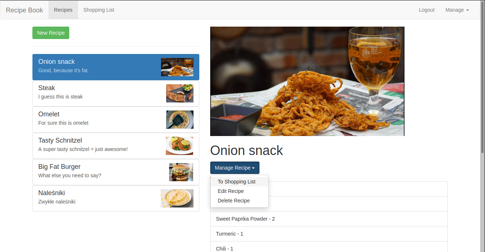
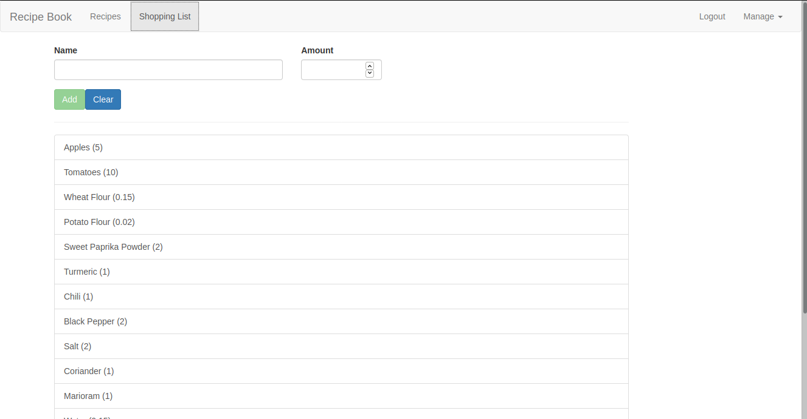

# Udemy-Recipe-Book

I did this project during my course on the Udemy (Angular - The Complete Guide by Maximilian Schwarzmüller)

## About the project

This is application has two main parts: list of recipes and shopping list
The user can view, add, edit and delete recipes. Recipes can be stored and fetched from Firebase.
Ingredients from recipe can be easily added to shopping list. 

*Side note: I used this application to save some recipes I was learning to cook*

## Used technology
* Angular 8
* Firebase *(as mocked backend)*

## Screenshots

